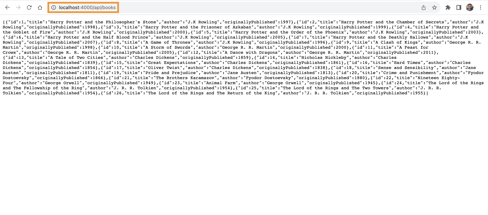
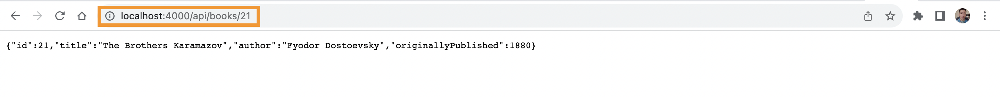
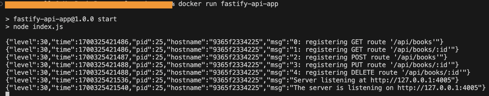

# Sample API Apps
## Introduction    
This repository contains several applications that behave as simple API servers. The goal is to have these applications containerised (e.g. inside a _Dockerfile_). These container images will then be stored in a registry (private or public) and then tested inside Kubernetes pods. The ultimate goal is to test if the endpoints of these applications can be reached from outside the Kubernetes cluster.

### fastify-api-app
A **Fastify** application that has a few CRUD endpoints involving book objects. Error validation is at a minimum. This application is only to be used for testing the api endpoints after the application is up and running inside a Kubernetes cluster.   
The application runs on the port specified inside the _.env_ file as
```bash
APP_PORT=4000
```
After performing an `npm install`, the application can be run with `npm run start`.   

Once the application is up and running, it is possible to access the endpoints in the browser by visiting
```bash
http://localhost:4000/api/books
```
to list all the books.   

   

To list a book by id, visit
```bash
http://localhost:4000/api/books/21
```
   

To run the application within a Docker container, make sure that you have a Docker daemon running (something like [Docker Desktop](https://docs.docker.com/get-docker/), [Rancher Desktop](https://docs.rancherdesktop.io/), or [colima](https://github.com/abiosoft/colima#getting-started) for MacOs) and that your laptop/desktop is authenticated to push/pull from [DockerHub](https://hub.docker.com/) and then run the following commands inside the same directory that the Dockerfile is in:
```bash
docker build . -t fastify-api-app:1.0.0
docker run -d --name fastify-api-app -p :8080 fastify-api-app:1.0.0
```
   

If the image is successfully built and runs, it can be pushed to [DockerHub](https://hub.docker.com/) with:
```bash
docker push yourDockerHubAccountName/fastify-api-app:1.0.0
```

### databases
#### MySQL
A MySQL database is created to run inside a Docker container. This is a simple database that consists of only one table. The table contains a list of books. The MySQL database gets initialised and populated with data from the `books-db-init.sql` script.   
Environment variables need to be passed into the Docker `build` command as follows:
```bash
docker build -t yourDockerHubAccountName/mysql_books_database:1.0.0 \ 
--build-arg MYSQL_PASSWORD=password \ 
--build-arg MYSQL_ROOT_PASSWORD=password .
```
To run the container in detached mode, 
```bash
docker run -d --name mysql_books_database -p :3306 yourDockerHubAccountName/mysql_books_database:1.0.0
```
Create a public repository in Dockerhub and then push this image as follows:
```bash
docker push yourDockerHubAccountName/mysql_books_database:1.0.0
```